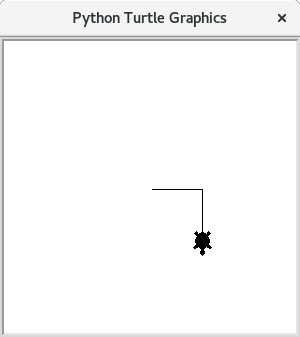
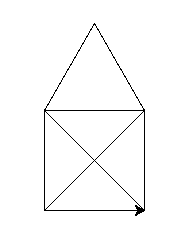

# Schildkröten

| [Zurück zum siebten Abschnitt](07Wiederholungen.md) | [Zurück zur ersten Seite](README.md) |

Nachdem Nun die gröbsten Grundlagen der Programmiersprache gelernt sind, fängt es jetzt an (noch mehr) Spaß zu machen. Im folgenden wird das Modul `turtle` verwendet. Dieses stellt eine einfache Möglichkeit zur Verfügung ein Fenster zu öffnen und in dieses Fenster mithilfe eines `turtles` zu zeichnen.

## Erstellen des Fensters

Die Datei `meine-kröte.py` sieht also bis jetzt so aus und erstellt bei Ausführung ein Fenster mit einem turtle in der mitte.

> ### Achtung
> Beim Speichern der Datei darf nicht der name `turtle.py` gewählt werden. Dieser Name wird quasi von dem `turtle`-Modul reserviert.

```python
import turtle

t = turtle.Pen()
t.shape("turtle")
```

Zunächst muss mit `import turtle` das `turtle`-modul geladen werden. Danach wird das Fenster geöffnet mit dem Befehl `turtle.Pen()`.
Damit später in dieses Fenster gezeichnet werden kann, muss es in einer Variablen `t` gespeichert werden.

Wenn man möchte, kann man auch noch das aussehen der "Schildkröte" verändern. Die Standardeinstellung ist ein dreieck, dessen Spitze in Laufrichtung zeigt. Mit dem Befehl `t.shape("turtle")` wird diese Form zu einer Schildkrötensiluette.


Nach dem Speichern und Ausführen, sollte ein Fenster sich öffnen, in dessen Mitte sich die Schildkröte befindet:


## Das Turtle bewegen und dabei zeichnen

Nun können Sie der Schildkröte Befehle geben. Es gibt unter anderem: `forward`, `left` und `right`. Dabei sind alle Befehle in Fahrtrichtung. Das heißt wenn am Anfang `t.left(90)` angegeben wird: Die Schildkröte zuerst nach rechts, und wird dann gegen den Urzeigersinn gedreht, sodass sie nach oben schaut.

Um also mit dem `turtle` einen rechten Winkel zu zeichnen, der zunächst waagerecht verläuft und dann nach unten geht kann man nun folgenden Code eingeben:

```python
import turtle

t = turtle.Pen()
t.shape("turtle")

t.forward(200)
t.right(90)
t.forward(200)
```
Das Ergebnis ist dann folgendes:



Es ist natürlich auch möglich weniger weit zu gehen `t.forward(87)` oder sich um einen anderen Winkel zu drehen `t.left(63)`.

> ### Übungen
> 1. Zeichnen Sie ein Quadrat
> 1. Zeichnen Sie ein Rechteck, welches doppelt so breit ist, wie hoch und nur eine Ecke gemeinsam mit dem ersten Quadrat hat.
> 1. Zeichnen Sie ein gleichseitiges Dreieck
> 
> Ergebis der Übung:
> 
> 

## Das Turtle bewegen, ohne zu zeichnen

Soll das Turtle an eine Position, ohne dabei eine Spur zu hinterlassen, dann kann man folgende Befehle verwenden:

 * `t.penup()`: sagt dem `turtle` höre auf zu zeichnen.
 * `t.pendown()`: sagt dem `turtle` fange wieder an zu zeichnen.

Man kann also dem `turtle` sagen zeichne jetzt nicht, dann kann man es ganz normal mit `forward`, `left` und `right` bewegen, und wenn das `turtle` wieder zeichnen soll, sagt man das einfach mit dem `pendown`-Befehl.

Beispiel einer unterbrochenen Linie (Achtung Die Befehle zum erstellen des `turtles` sind hier weg gelassen):

```python
t.forward(30)
t.penup()
t.forward(30)
t.pendown()
t.forward(30)
t.penup()
t.forward(30)
t.pendown()
t.forward(30)
```

> ### Übung
> Zeichnen Sie 3 Quadrate mit dem selben Mittelpunkt wobei jeweils das folgende kleiner ist als das erste.
> 
> Ergebnis:
> 
> 

## Rechnen in Python

Wenn Sie bestimmte Formen zeichnen wollen, so müssen Sie bestimmte Winkel und längen berechnen. Im rechtwinkligen Dreieck lässt sich das sehr einfach durch die Formel von Pythagoras $a² + b² = c²$ lösen. Also die beiden kürzeren Seitenlängen eines rechtwinkligen Dreiecks quadriert und zusammengezählt ergeben das quadrat der längsten Seitenlänge.

Um aus dieser Quadratszahl die Wurzel zu berechnen benötigen sie die Wurzelfunktion. Diese ist in dem `math` modul enthalten.

Import und Verwendung der `sqrt` Wurzelfunktion:

```python
import math
a = 5
b = 7
c = math.sqrt(a * a + b * b)
```

> ### Übung
> 
> Zeichnen Sie das Haus vom Nikolaus. Berechnen Sie dabei die Länge der diagonalen in Python.
> 
> 

| [Weiter zum nächsten Abschnitt](09Sterne.md) |
