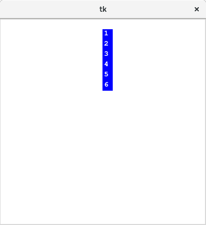

# Animation

[Zurück zum siebzehnten Abschnitt](Computerspiel.md) | [Zurück zur ersten Seite](README.md)

Ein Spiel wäre nun relativ langweilig, wenn sich nichts "bewegen" würde. Bei diesem Spiel Soll sich eine Schlange bewegen. Bewegung heißt, dass der Pixel vor dem Kopf der Schlange blau wird, und der letzte wieder weiß.

Man kann feststellen, dass ein Pixel, der gerade Blau wird noch so lange blau ist, wie die Schlange lang ist. Man kann also in jedem Schritt von jedem Pixel der Schlange eins abziehen.

> ### Aufgabe: Alle minus eins
>  * Schreiben Sie eine Funktion namens `ame()`, welche von jedem Pixel im Spielfeld eines abzieht, wenn dieser größer ist als `0`
> 
> Orientieren Sie sich dabei an:
> 
> ```python
> def ame():
>     for i in range(400):
>         s.level[i] -= 1
> ```
> 
>  * Generieren Sie ein Testlevel:
> 
>    
> 
>  * Überprüfen Sie, ob `ame()` funktioniert.

# Frames

Wie Oben dargestellt muss diese `ame()`-Funktion jetzt jedes mal, wenn das Bild neu gezeichnet wird ausgeführt werden. Die meisten Programme bieten hierfür eine Möglichkeit die Funktion als solche zu registrieren.

Das `game`-modul bietet diese Möglichkeit mit dem Befehl: `s.addStep(ame)`

Ist diese Zeile noch hinzu gefügt, dann müsste sich jetzt ein Bild ähnlich folgendem bieten:

[Video snake Test](img/snaketest.webm)
