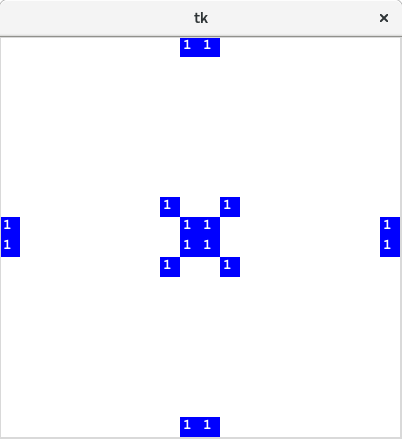

# Computerspiele

[Zurück zum sechzehnten Abschnitt](AufgabenEpochenheft.md) | [Zurück zur ersten Seite](README.md)

Das nächste Ziel ist ein kleine Snake-Spiel zu entwickeln.


Die Regeln:
  * Die Schlange bewegt sich immer forwärts und hält nie an.
  * Sie kann waagerecht, oder senkrecht kriechen.
  * Sie darf nicht über sich selbst kriechen.
  * Wenn sie einen Punkt frisst wird sie länger.
  * Das Ziel ist es möglichst Viele Punkte zu fressen.

# Der Bildschirm und Pixel

Um ein Spiel zu spielen wird auf dem Bildschirm das Bild des Computerspiels angezeigt.
Es besteht aus vielen kleinen Punkten, die Pixel genannt werden. Der Computer muss dem Bildschirm 60 mal in der Sekunde sagen wie jetzt aktuell welcher Pixel eingefärbt werden soll. Jeder Pixel ist dabei als eine Kombination von drei Farben angegeben: Rot, Grün, Blau.

Für das Snake wird diese Darstellung von dem Pythonmodul game.py so vereinfacht, dass nur ein Fenster sich öffnet, welches 20x20 Pixel enthält. Die Farben werden so vereinfacht, dass alle positiven Zahlen blau sind, alle negativen eine andere Farbe haben. 0 ist weiß.

Das was der Bildschirm anzeigt ist eine Liste von Zahlen. Zum Beispiel so:

```python
[0,0,0,0,1,2,3,4,0,-1]
```

Wären also vier weiße , vier blaue, noch ein weißer, und ein roter Pixel.

Diese Liste wird `level` genannt. Die Liste hat nur eine Dimmension, das heißt alle Pixel liegen in einer Zeile nacheinander. Dass man damit das quadratische Spielfeld füllen kann, besteht die erste Zeile aus den ersten 20 Zahlen, danach kommt mit den nächsten 20 Zahlen die zweite Zeile und so weiter.

# Starten des Spiels

Wie auch das `turtle`-Modul muss das passende `game`-modul erst geladen werden. Dies geschieht mit `import game`.

Im nächsten Schritt wird ein neues Spielfenster erzeugt: `s = game.Spiel()`

Jetzt wird das leere `level` generiert, also ein `level`, das überall `0` stehen hat: `s.create()`

Und zuletzt wird das Spiel gestartet mit: `s.start()`

Die `snake.py`-Datei sieht also bis jetzt so aus:

```python
import game

s = game.Spiel()
s.create()

s.start()
```

Alles was wir jetzt weiter mit dieser Datei verändern muss **zwischen** die `s.create()` und `s.start()` Zeile.

> ### Aufgabe: Starten des Fensters
> 
> Öffnen und starten Sie ein Spiel. Probieren Sie dabei zwischendurch immerwieder ob alles funktioniert wie erwartet.
>
> Es ist völlig normal, dass der Inhalt des Fensters komplett weiß ist.

# Zugriff auf das Level

Nachdem nun das Spielfenster geöffnet ist, können einzelne Pixel verändert werden.
in `s.level` ist die gesamte Liste der Pixel gespeichert. Es kann nun zum Beispiel der zehnte Pixel blau gefärbt werden, indem man folgende Zeilen einfügt:

```python
s.level[9] = 1
```

> ### Aufgabe: Das erste Level
> 
> * Verändern Sie das Level so, dass es dieses Muster hat:
> 
> 
>
> * Zeichnen Sie dieses Level mit einer Funktion namens `level1`.
> * Erstellen Sie noch eine Funktion `level2`, die ein eigenes Muster macht.

[Weiter zum nächsten Abschnitt](Animation.md) |
