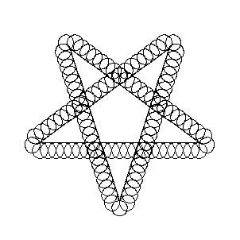

# For Schleifen

[Zurück: Kapitel 8 - Fallunterscheidung](BedingtesAusfuehren.md) |  [Home](README.md) |  [Weiter: Kapitel 10 - Listen](Listen.md) | 

## Wiederholung für eine bestimmte Anzahl

Möchte man etwas eine bestimmte Anzahl oft wiederholen, so könnte man dies mit einer
`while` schleife tun, muss dann aber "mitzählen" und aufhören, wenn die gewünschte Anzahl von Durchläufen erreicht ist.

Deutlich einfacher geht dies mit `for`:

```python
for x in range(5):
    print("Durchlauf Nummer:", x)
```

Dieses Programm wiederholt 5 mal den `print`-Befehl. Dabei ist das `x` im ersten durchlauf `0`, dann `1` usw. bis `4`. Die Nummer `5` wird nie erreicht.

Ein zweites Beispiel:

```python
for i in range(30):
    t.forward(100)
    t.left(170)
```

Der eingerückte Teil von wird also genau 30 mal wiederholt. Diesmal ist die Variable `i` genannt, die die Nummer des durchlaufs enthält...

> ### Übungen
>
> Speichern Sie Ihre Lösung in die Datei `TurtleFor.py`
>
> 1. Zeichnen Sie ein Quadrat mit `for`.
> 2. Zeichnen Sie einen Kreis ohne dass Sie `t.circle` verwenden.
> 3. Zeichnen Sie einen Stern mit `for`.
>
> Speichern Sie folgendes in eine `fünfsten-variation.py` Datei.
> 1. Zeichnen Sie einen Fünstern indem Sie `for` benutzen. Sie brauchen natürlich auch `t.forward` und `t.left` …
> 2. Ersetzen Sie das `t.forward` durch ein weiteres for und zeichnen Sie ein Muster statt der Kante:
>
> 
> 

[Zurück: Kapitel 8 - Fallunterscheidung](BedingtesAusfuehren.md) |  [Home](README.md) |  [Weiter: Kapitel 10 - Listen](Listen.md) | 
