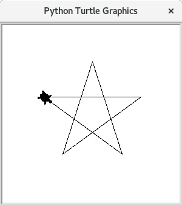
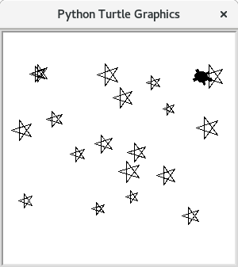

# Sterne zeichnen mit Turtle

[Zurück: Kapitel 14 - Zufall](Zufall.md) |  [Home](README.md) |  [Weiter: Kapitel 16 - Kreise](Kreise.md) | 

> ### Übung
>
> Speichern Sie diese Übung als `sternchen-uebung.py`
>
> Zeichnen Sie einen Fünfstern. Der Innenwinkel in einem Fünfstern ist 36° Grad.
>
> 

Im Folgenden wird es Ziel sein viele Fünfsterne zu zeichnen in unterschiedlichen Größen.
Eine Möglichkeit das zu tun wäre nun, den bisher geschriebenen Code einfach zu kopieren und woanders wieder einzufügen.
Man muss nun nur noch ein paar Zahlen ändern und fertig ist der zweite Stern.

Schon ab zwanzig verschieden großen Sternen artet das aber in Arbeit aus.

## Funktionen

Beim Programmieren möchte man aber solche wiederholende Aufgaben eigentlich lieber den Computer selbst machen lassen.
Das heißt man schreibt zunächst eine Schablone und sagt dem Computer was er veränderbar in dieser Schablone machen soll.

Statt dem Bild der Schablone könnte man sich auch ein Kochrezept vorstellen. Man schreibt in das Rezept wie ein Kuchen oder ähnliches gebacken wird. Später muss man das Rezept noch backen.

Eine Schablone, beim Programmieren nennt man Funktion und erstellt sie so:

```
def stern(größe):
    t.forward(größe)
    t.left(144)
    t.forward(größe)
    t.left(144)
    #… usw.
```

Indem man zunächst das Schlüsselwort `def` schreibt, sagt man Python dass nun eine Schablone kommt, die nicht sofort ausgeführt
werden soll, sondern die sich das Programm erst mal merken soll. Danach folgt ein beliebiger Name in diesem Fall ist `stern` gewählt worden.
Zuletzt kommt in Klammern eine Liste der veränderlichen Namen als Platzhalter. Für den Stern wird erst mal nur die `größe` veränderlich sein.
Statt nun eine feste Zahl vorwärts zu gehen, muss man jetzt die veränderliche Größe aus der Schablone vorwärts gehen.
Für alle Fünfsterne sind die Winkel die selben. Das heißt man kann die Zeilen mit `left` unveränderbar lassen,
indem man einfach konstante Zahlen schreibt.

Diese Funktionsschablone wird jetzt aber noch nicht ausgeführt. Man sagt Python nur wie die Schablone bzw. das Rezept aussieht.
Um jetzt einen Stern zu zeichnen, muss man diese Schablone verwenden, und Python sagen, welcher Platzhalter welchen Wert annehmen soll.

```
stern(größe=100)
```

Jetzt wird tatsächlich etwas gezeichnet natürlich noch nicht der volle Stern, da bis jetzt nur eine Linie gezeichnet wird.
Zunächst schreibt man also einfach den Namen der Funktion,
dann in Klammern die Zuweisungen, welcher Platzhalter welchen Wert erhalten soll. Es kann Ihnen hier auffallen,
dass Sie die ganze Zeit schon solche Funktionen verwendet haben zum Beispiel `print`, `input`, `t.forward`, `t.left` usw…

> ### Übung
>
> Speichern Sie diese Datei unter `sternhimmel-uebung.py`
>
> 1. Ergänzen Sie die `stern`-Funktion, sodass sie den gesamten Stern zeichnet
> 2. Schreiben Sie eine Funktion `teleport`, die die Schildkröte an einen neuen Platz befördert, ohne zu zeichnen. Übergeben Sie den neuen Platz als `x` und `y` Koordinaten.
     Dabei benötigen Sie [`penup` und `pendown`](Turtle.md#das-turtle-bewegen-ohne-zu-zeichnen) und [`t.goto`](Turtlebefehle.md).
> 3. Zeichnen Sie 20 Sterne mit zufälliger Positionierung verwenden Sie die Funktion von aufgabe 2 zum Platzwechsel. Für die zufällige Positionierung verwenden Sie [Zufall](Zufall.md)
> 2. Zeichnen Sie 20 verschieden große Sterne mit gleichem Zentrum.
>
> Beispiele:
>
> 
> 

[Zurück: Kapitel 14 - Zufall](Zufall.md) |  [Home](README.md) |  [Weiter: Kapitel 16 - Kreise](Kreise.md) | 
