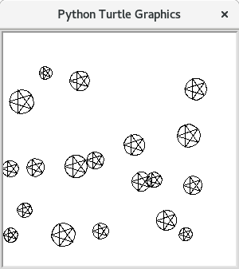

# Zeichnen von Kreisen

[Zurück: Kapitel 11 - Funktionen](Funktionen.md) |  [Home](README.md) |  [Weiter: Kapitel 13 - Kommentare](Kommentare.md) | 

Möchte man zum Beispiel einen Kreis um die Sterne oder ein Herz zeichnen, so benötigt man
gebogene Linien.

Turtle kann Kreise zeichnen.

```python
t.circle(radius=150)
```

Wenn man möchte kann man zusätzlich noch `extent` also wie viel Grad des Kreises
gezeichnet werden soll angeben. Außerdem kann man noch in `steps` angeben wieviele "Ecken" der Kreis hat.
Computer zeichnen nie wirkliche kreise, sondern immer nur Vielecke mit sehr vielen Ecken...
Soll zum Beispiel ein halbkreis mit radius 50 gezeichnet werden, kann folgender Befehl verwendet werden:

```python
t.circle(radius=50, extent=180, steps=5)
```

> ### Übungen
> 
> 1. Zeichnen Sie ein Herz ind der Datei `herzi.py`. Machen Sie sich dabei vorher Gedanken, wie dieses aufgebaut ist, dass Sie strukturiert vorgehen können.
> 2. Erweitern Sie die Sterndatei um eine Funktion Kreisstern, welche einen Stern und darum einen Kreis zeichnet.
> 3. Bonus: Schauen Sie in der [Turtle Befehlssammlung](Turtlebefehle.md) nach, wie sie das Herz Farbig gestalten können, bzw. die Linien anders gestalten können.
> 
>  

[Zurück: Kapitel 11 - Funktionen](Funktionen.md) |  [Home](README.md) |  [Weiter: Kapitel 13 - Kommentare](Kommentare.md) | 
