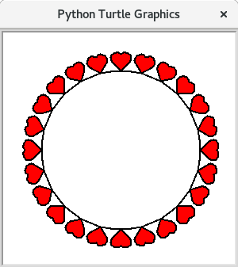

# Eine Liste von möglichen Turtlegrafiken

| [Zurück zum elften Abschnitt](Turtlebefehle.md) | [Zurück zur ersten Seite](README.md) |

## YinYang

Benötigt werden:
  * [Kreise](10Kreise.md)
  * [Bewegen ohne Zeichnen](08Turtle.md#das-turtle-bewegen-ohne-zu-zeichnen)
  * [begin_fill, end_fill](11Turtlebefehle.md)

  
  
## Sechseckspirale
Zeichnen Sie einer Sechseckspirale. Der Trick ist, dass man nicht genau den Winkel 60° dreht, sondern knapp daneben z.B. 59°. Die Farben müssen aus einer Liste von Farben ausgewählt werden.

Benötigt werden:

  * [Forschleifen](14Forschleifen.md)
  * [Listen für die Farben](12Turtlebeispielaufgaben.md)

  

## Viereckspirale

Zeichnen Sie einer Viereckspirale in Schwarzweiß. Der Trick ist, dass man nicht genau den Winkel 90° dreht, sondern knapp daneben z.B. 89°.

Benötigt werden:

  * [Forschleifen](14Forschleifen.md)

  

## Viereckspirale bunt

Zeichnen Sie einer Viereckspirale. Die Farben müssen aus einer Liste von Farben ausgewählt werden.

Benötigt werden:

  * [Forschleifen](14Forschleifen.md)
  * [Listen für die Farben](12Turtlebeispielaufgaben.md)

  

## Mathematische Graphen

Mit turtle und der `goto(x,y)` Funktion kann man sehr gut mathematische Graphen, wie zum Beispiel Parabeln zeichnen.

Benötigt werden:

  * [Forschleifen](14Forschleifen.md)
  * [Goto](11Turtlebefehle.md)
  * [Bewegen ohne Zeichnen](08Turtle.md#das-turtle-bewegen-ohne-zu-zeichnen)

  
  
## Mandala mit Herzen

Zeichnen Sie ein Mandala mit Sternchen, Herzen und Kreisen.

Benötigt werden:

  * [Forschleifen](14Forschleifen.md)
  * [Funktionen](09Sterne.md#funktionen)
  * [Das Herz](10Kreise.md)
  * [begin_fill, end_fill](11Turtlebefehle.md)
  
  

[Weiter zum nächsten Abschnitt](Listen.md) |
