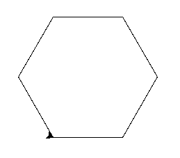
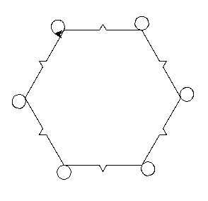

# Zeichnen eines Mandalas mit turtle grafiken.

[Zurück: Kapitel 9 - Wiederholungen mit While](Wiederholungenwhile.md) |  [Home](README.md) |  [Weiter: Kapitel 11 - Listen](Listen.md) | 

Natürlich kann `while` auch mit `turtle` zusammen verwendet werden.

```python
import turtle
t = turtle.Pen()
while 1 == 1:
    t.forward(100)
    t.left(60)
```

Ergibt folgendes Bild:



Das Turtle läuft immer weiter auf der selben Spur.

Dieses Sechseck kann jetzt verschönert werden. Zum Beispiel kann man kleine Kreise an die Ecken zeichnen, oder dreiecke in die Mitte wie hier:



> ### Übungen
> 
> Die folgende Übung wird in Datei `sechseck.py` gespeichert.
> 
> 1. Programmieren Sie ein turgle Sechseck.
> 2. Verzieren Sie dieses mit einem **eigenen** "Muster". Achten Sie drarauf, dass das Sechseck noch zu erkennen ist.
> 
> Die nächste Übung wird in `fünfstern.py` gespeichert.
> 
> 1. Programmieren Sie einen Fünfstern mit einem turtle.
> 2. Verzieren Sie diesen mit eigenen Ideen. Achten Sie auch hier darauf, dass es ein Fünfstern bleibt.
> 
> Beispiel:
> 
> 

[Zurück: Kapitel 9 - Wiederholungen mit While](Wiederholungenwhile.md) |  [Home](README.md) |  [Weiter: Kapitel 11 - Listen](Listen.md) | 


